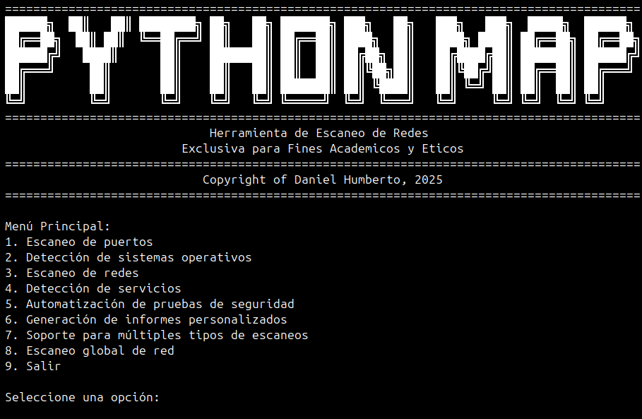

# Python Map

## Herramienta de Auditoría y Escaneo de Redes



## Descripción

Python Map es una herramienta de línea de comandos basada en Python que proporciona una interfaz amigable para realizar auditorías de seguridad de red utilizando la biblioteca nmap. Diseñada exclusivamente para fines académicos y éticos, esta herramienta facilita diferentes tipos de escaneo de red, análisis de puertos, detección de servicios y sistemas operativos.

## Características

- **Escaneo de Puertos**: Detección de puertos abiertos e identificación de servicios en puertos específicos.
- **Detección de Sistemas Operativos**: Identificación y análisis detallado de sistemas operativos en dispositivos remotos.
- **Escaneo de Redes**: Capacidad para escanear rangos completos de IPs y descubrir dispositivos activos en una red.
- **Detección de Servicios**: Identificación detallada de servicios y sus versiones, incluyendo la obtención de banners.
- **Automatización de Pruebas de Seguridad**: Generación automática de reportes de seguridad básicos.
- **Generación de Informes Personalizados**: Creación de informes detallados con información completa sobre objetivos escaneados.
- **Múltiples Tipos de Escaneo**: Soporte para escaneos TCP, UDP, SYN, ACK y configuraciones personalizadas de nmap.
- **Escaneo Completo de Red**: Análisis completo de redes con descubrimiento de hosts, puertos, servicios y sistemas operativos.

## Requisitos

- Python 3.6+
- Biblioteca `python-nmap`
- nmap instalado en el sistema
- Privilegios de superusuario (para ciertas operaciones de escaneo)

## Uso

Ejecutar la herramienta con privilegios de superusuario:

```bash
sudo python3 python_map.py
```

### Menú Principal

La herramienta presenta un menú interactivo con las siguientes opciones:

1. **Escaneo de puertos**
   - Detectar puertos abiertos
   - Identificar servicios en puertos

2. **Detección de sistemas operativos**
   - Identificar SO
   - Obtener detalles del SO

3. **Escaneo de redes**
   - Escanear rango de IPs
   - Identificar dispositivos activos

4. **Detección de servicios**
   - Identificar servicios y versiones
   - Obtener banners de servicios

5. **Automatización de pruebas de seguridad**
   - Genera un reporte completo de seguridad

6. **Generación de informes personalizados**
   - Crea informes detallados con información exhaustiva

7. **Soporte para múltiples tipos de escaneos**
   - Escaneos TCP/UDP/SYN/ACK
   - Escaneo intensivo personalizado

8. **Escaneo global de red**
   - Análisis completo de la red en 4 pasos

## Reportes Generados

La herramienta genera los siguientes tipos de reportes:

- `security_scan_[timestamp].txt`: Reporte básico de seguridad
- `detailed_report_[timestamp].txt`: Informe detallado personalizado
- `global_network_scan_[timestamp].txt`: Reporte completo de escaneo global de red

## Aspectos Legales y Éticos

⚠️ **IMPORTANTE**: Esta herramienta está diseñada exclusivamente para fines académicos y éticos. El uso de esta herramienta para escanear redes sin autorización explícita puede constituir un delito. 

## Limitaciones Conocidas

- Algunos escaneos pueden tardar mucho tiempo en redes grandes
- Ciertos sistemas pueden detectar y bloquear los escaneos
- La precisión de la detección de sistemas operativos puede variar

## Licencia


Este proyecto está licenciado bajo los términos de la licencia GNU.
